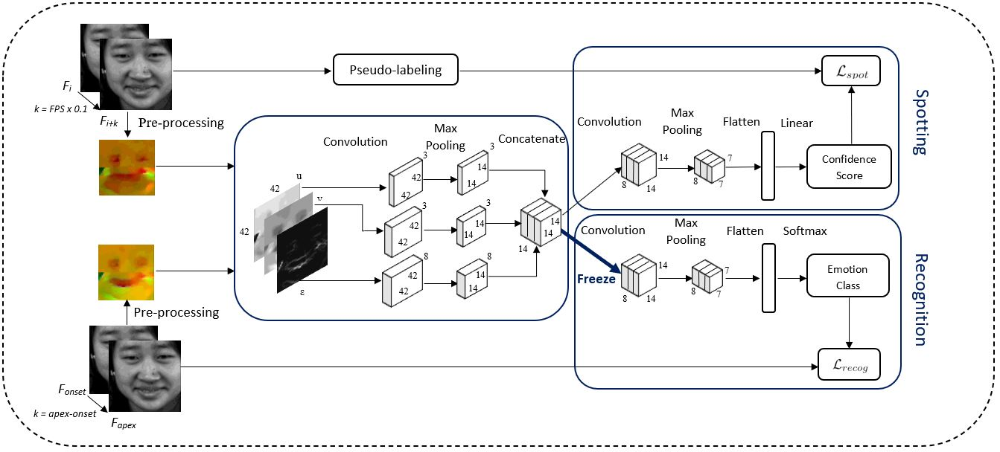

<!-- # Micro-Expression Analysis Network to spot-then-recognize micro-expressions

This is the extended work of <a href="https://arxiv.org/pdf/2106.06489.pdf">Paper</a> and <a href="https://github.com/genbing99/SoftNet-SpotME">Project</a>. 

Notably, this is the first known work that addresses micro-expression analysis (spot-then-recognize) on long videos, particularly with the deep-learning approach.

## Framework of Proposed MEAN Architecture
Overview of the end-to-end MEAN architecture with two-step learning paradigm: </br></br>


A two-step learning procedure using inductive transfer learning is proposed to first spot the micro-expression interval then classify the emotion class:
<ul>
 <li> Micro-expression Spotting - First trained with linear output at the end of the network to assign a spotting confidence score to each frame. </li>
 <li> Micro-expression Recognition - The knowledge learned from spotting is transferred in the shared layers, replaced the output with a softmax layer to classify the emotion. </li>
</ul>

## Training
Tensorflow and Keras are used for implementation. Six datasets are involved in the experiment, where four are short videos and two are long videos, links are provided:
<ul>
 <li> Short Videos </li>
  &#8594 CASME II - http://fu.psych.ac.cn/CASME/casme2-en.php <br>
  &#8594 SMIC - https://www.oulu.fi/cmvs/node/41319 (Subsets SMIC-E-HS, SMIC-E-VIS, SMIC-E-NIR)  <br>
 <li> Long Videos </li>
  &#8594 CAS(ME)<sup>2</sup> - http://fu.psych.ac.cn/CASME/cas(me)2-en.php <br>
  &#8594 SAMM Long Videos - http://www2.docm.mmu.ac.uk/STAFF/M.Yap/dataset.php <br>
</ul>
 
## Reproduce the results

<b>Step 1)</b> Download the micro-expression datasets for experiment, we suggest the files to be structured as follows:
>├─MEAN_Weights <br>
>├─Utils <br>
>├─define_model.py <br>
>├─face_crop.py <br>
>├─feature_extraction.py <br>
>├─load_excel.py <br>
>├─load_images.py <br>
>├─main.py <br>
>├─prepare_training.py <br>
>├─train_evaluate.py <br>
>├─training_utils.py <br>
>├─requirements.txt <br>
>├─CASME_sq <br>
>>├─code_final.xlsx <br>
>>├─rawpic <br>

>├─CASME2 <br>
>>├─CASME2 <br>
>>>├─CASME2-RAW <br>
>>>└─CASME2_label_Ver_2.xls <br>

>├─SAMM <br>
>>└─SAMM_20181215_Micro_FACS_Codes_v2.xlsx <br>

>├─SAMMLV <br>
>>├─SAMM_longvideos <br>
>>└─SAMM_LongVideos_V2_Release.xlsx <br>

>└─SMIC <br>
>>├─SMIC-E_raw image <br>
>>├─HS_long <br>
>>>├─SMIC-HS-E <br>
>>>>├─HS <br>
>>>└─SMIC-HS-E_annotation.xlsx <br>

>>├─NIR_long <br>
>>>└─SMIC-NIR-E <br>
>>>>├─NIR <br>
>>>└─SMIC-NIR-E_annotation.xlsx <br>

>>└─VIS_long <br>
>>>└─SMIC-VIS-E <br>
>>>>├─VIS <br>
>>>└─SMIC-VIS-E_annotation.xlsx <br>


<b>Step 2)</b> Installation of packages using pip

``` pip install -r requirements.txt ```
<!--

<b>Step 3)</b> Dataset setting

Open main.py, change the dataset name and expression type for evaluation.
-->
<b>Step 3)</b> MEAN Training and Evaluation

``` python main.py ```

#### &nbsp; Note for parameter settings <br>
&nbsp;&nbsp; --dataset_name (CASME_sq/SAMMLV/CASME2/SMIC_HS/SMIC_VIS/SMIC_NIR) <br>
&nbsp;&nbsp; --train (True/False) *False using pretrained weights <br>

## Additional Notes

##### Please email me at genbing67@gmail.com if you have any inquiries or issues.
 -->
