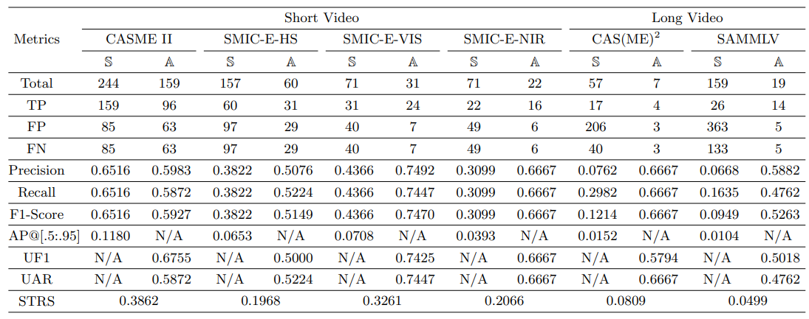

## MEAN architecture

Characteristics: </br>
<ul>
<li> Shallow network </li> 
<li> Multi-stream </li>
<li> Multi-output with two task-specific networks </li>
<li> Capable of both micro-expression spotting and recognition </li>
</ul>

## Results
Take note that analysis is equivalent to spot-then-recognize and STRS is our proposed evaluation metric. </br>
Please refer to the paper for more experiment results. </br>
Here is the detailed result for micro-expression spotting (S) and analysis (A): </br>
 

## How to run the code

<b>Step 1)</b> Download the micro-expression datasets for experiment, we suggest the files to be structured as follows:
>├─MEAN_Weights <br>
>├─Utils <br>
>├─define_model.py <br>
>├─face_crop.py <br>
>├─feature_extraction.py <br>
>├─load_excel.py <br>
>├─load_images.py <br>
>├─main.py <br>
>├─prepare_training.py <br>
>├─train_evaluate.py <br>
>├─training_utils.py <br>
>├─requirements.txt <br>
>├─CASME_sq <br>
>>├─code_final.xlsx <br>
>>├─rawpic <br>

>├─CASME2 <br>
>>├─CASME2 <br>
>>>├─CASME2-RAW <br>
>>>└─CASME2_label_Ver_2.xls <br>

>├─SAMM <br>
>>└─SAMM_20181215_Micro_FACS_Codes_v2.xlsx <br>

>├─SAMMLV <br>
>>├─SAMM_longvideos <br>
>>└─SAMM_LongVideos_V2_Release.xlsx <br>

>└─SMIC <br>
>>├─SMIC-E_raw image <br>
>>├─HS_long <br>
>>>├─SMIC-HS-E <br>
>>>>├─HS <br>
>>>└─SMIC-HS-E_annotation.xlsx <br>

>>├─NIR_long <br>
>>>└─SMIC-NIR-E <br>
>>>>├─NIR <br>
>>>└─SMIC-NIR-E_annotation.xlsx <br>

>>└─VIS_long <br>
>>>└─SMIC-VIS-E <br>
>>>>├─VIS <br>
>>>└─SMIC-VIS-E_annotation.xlsx <br>


<b>Step 2)</b> Installation of packages using pip

``` pip install -r requirements.txt ```
<!--

<b>Step 3)</b> Dataset setting

Open main.py, change the dataset name and expression type for evaluation.
-->
<b>Step 3)</b> MEAN Training and Evaluation

``` python main.py ```

#### &nbsp; Note for parameter settings <br>
&nbsp;&nbsp; --dataset_name (CASME_sq/SAMMLV/CASME2/SMIC_HS/SMIC_VIS/SMIC_NIR) <br>
&nbsp;&nbsp; --train (True/False)

## Additional Notes
If you find this work useful, please cite the paper: <br> <br>
@article{liong2023spot, <br>
  title={Spot-then-Recognize: A Micro-Expression Analysis Network for Seamless Evaluation of Long Videos}, <br>
  author={Liong, Gen-Bing and See, John and Chan, Chee-Seng}, <br>
  journal={Signal Processing: Image Communication}, <br>
  volume={110}, <br>
  pages={116875}, <br>
  year={2023}, <br>
  publisher={Elsevier} <br>
} <br>

##### Please email me at genbing67@gmail.com if you have any inquiries or issues.
